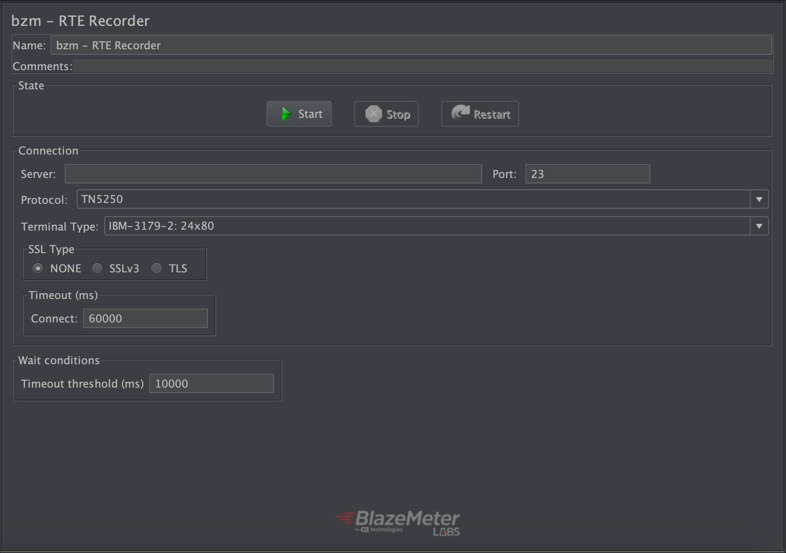
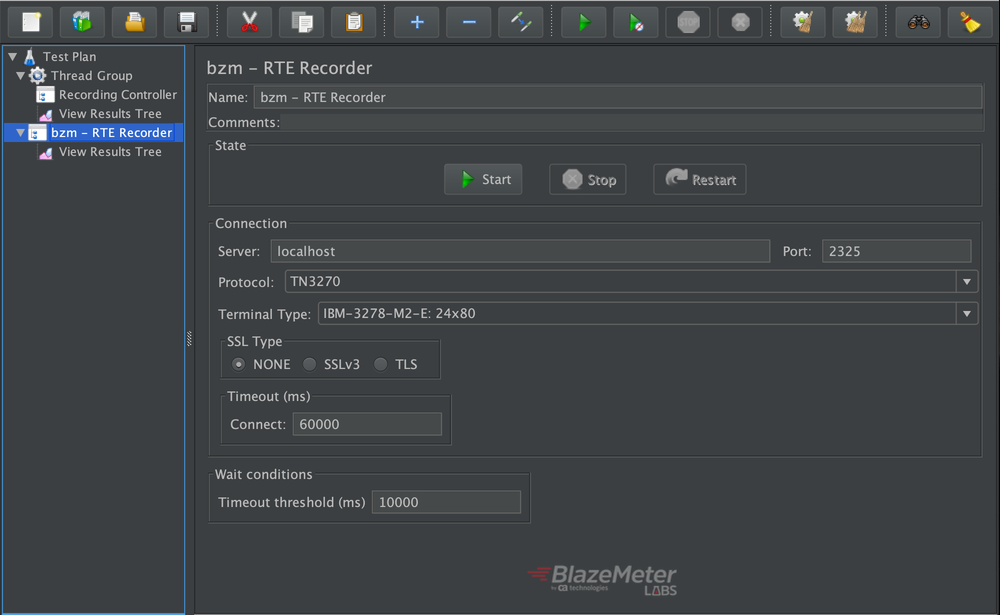
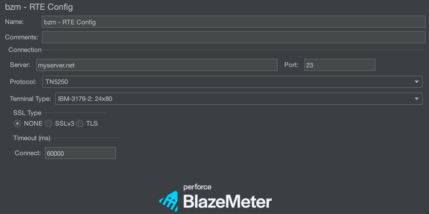

# JMeter-RTE-plugin

This project implements a JMeter plugin to **support RTE (Remote Terminal Emulation) protocols** by providing a recorder for automatic test plan creation, and config and sampler for protocol interactions.

Nowadays the plugin supports **IBM protocol's TN5250 and TN3270** by using embedded [xtn5250](https://sourceforge.net/projects/xtn5250/) and [dm3270](http://dmolony.github.io/) emulators with modifications ([xtn5250 fork](https://github.com/abstracta/xtn5250) and [dm3270 fork](https://github.com/abstracta/dm3270)) to better accommodate to the plugin usage (exception handling, logging, external dependencies, etc).

People who usually work with these IBM servers interact with them, basically, by sending keystrokes from the terminal keyboard (or emulator) to fill forms or call processes. The plugin provides a [recording controller](#a-recording-controller-rte-recorder), which allows the user to interact through a terminal emulator, recording every interaction (samplers) with the mainframe application. Additionally, the plugin allows for manual test plan creation, providing a config element for setting connection parameters and a sampler to set fields on screen and attention key to send to the mainframe application. Besides, the sampler allows to simulate the existing attention keys on the terminal keyboard like ENTER, F1, F2, F3..., ATTN, CLEAR, etc.  

## Usage

### Using the plugin
The plugin adds three different elements to JMeter:

#### A Recording Controller (RTE-Recorder)
 

##### Configuring the RTE Recorder
First all is necessary to add a template which is going to contain all the elements required to begin with recording.
Go to Files -> Templates -> and select _Recording RTE_

##### Usage of RTE Recorder

To start recording, the user should specify the _Server_, _Port_, _Protocol_, _Terminal Type_, _SSL Type_, _Timeout_ and _Timeout Threshold_. These configurations are the same ones detailed in [RTE-Config](#a-config-element-rte-config). Details about Timeout Threshold field and how the wait conditions works can be found [here](docs/wait-conditions-recording.md).
 
 > RTE recorder buttons purpose:
 > - *Start*: This button allows the user to begin with the recording and to connect to the mainframe application through a terminal emulator. Additionally, after button is pressed, an RTE-Config and Connect Sampler will be added to the test plan. 
 > - *Stop*: This button allows the user to stop current recording. Once this button is pressed, the recording will be stopped and Disconnect Sampler will be added to the test plan followed by the closure of the terminal emulator.
 > - *Restart*: This button is the equivalent to pressing stop and start buttons.
 > - *Timeout Threshold*: This field will set the timeout which later on the [waits conditions ](docs/wait-conditions-recording.md)will use to set the proper time out for the conditions.

Once everything is configured, the user proceeds to start the recording session, pressing START button. After the connection to the mainframe application is established (supposing configurations are right), the **Terminal Emulator** will show up. 

>If you click on the  icon in the emulator, a pop up window will be displayed with general help information on the emulator: shortcuts, explanation about indicators on the screen, etc

Now we are able to interact with our client through RTE-Emulator. Every interaction will be automatically saved in samplers (_[check out everything about samplers ](#sampler-rte-sampler)_).
Once we have ended the flow that we want to record, we can easily close the terminal emulator or press STOP button to stop our recording. 

##### Child View Results Tree integration:

When a View Results Tree JMeter test element is included as a child of the RTE recorder, then all interactions between the Terminal Emulator and the mainframe application will be showed on the View Results Tree and allow for proper analysis and validation of all information sent and received from the mainframe application.

#### A Config Element (RTE Config)

The RTE Config element sets the parameters to be used by the sampler in order to establish a connection to the server. These parameters are:

- *Server* (required). The url or ip of the IBM server.
- *Port*. The port number to connect, default value is 23.
- *Protocol* (required). The protocol to use in the communication. If the server is an AS400 or iSeries it typically uses TN5250, on the other hand, if it's a mainframe system it uses TN3270.
- *Terminal Type*. The terminal type to emulate from the client. If the server does not supports the chosen one, it will use the default value for the protocol.
- *SSL Type*. The SSL protocol to use if it's required by the server. The keystore file and password can be specified in *system.properties* file by adding the lines `javax.net.ssl.keyStore=</keystore_path/file.keystore>`, `javax.net.ssl.keyStorePassword=<changeit>`. The truststore file can be specified in same file with `javax.net.ssl.trustStore=</keystore_path/file.keystore>`.  
- *Timeout*. The maximum time to wait to establish the connection by the sampler. This time takes into account the time until the client receives a response screen from the server. 

If more than one RTE Config element is used at the same level of the Test Plan, JMeter will take the value of the first one. On the other hand, if there are more than one RTE Config used but in different levels, JMeter will use the "closest" (according to test plan tree levels) Config element for each sampler.

#### Sampler (RTE Sampler)

Connections are shared by RTE Samplers in same thread created by a thread group (different threads use separate connections). The RTE Sampler element checks if a connection exists to send the packets, if none exists, it uses the RTE Config data to establish a new one. Connections are automatically closed (unless Jmeter property `RTEConnectionConfig.reuseConnections=true` is specified in *jmeter.properties*) at the end of each thread iteration. 

This means that it's **always required an RTE Config Element** in order to connect the RTE samplers to a server.

The RTE Sampler fields are:
- *Action*. Specifies how the sampler will operate among 3 options:
  - *Connect*. When this option is selected the sampler will just connect to the terminal server, wait for specified conditions, and output the welcome screen. If a connection is already established to the server, then the sampler will not affect current connection, will wait for specified conditions, and return current emulator screen. This action is useful to validate for welcome screens or just wait for some condition.
    > It is not mandatory to add a sampler with connect action to interact with the server, because a "Send keys" sampler will auto connect if no connection already exists.
  - *Send keys*. This option allows to fill and submit fields to the server with an associated attention key, wait for specified conditions and get the resulting emulator screen. If no connection is already established, this element will automatically create one.
  - *Disconnect*. This option allows to explicitly close the connection to the terminal server. This allows to restart the emulator status by re connecting to the server en following samplers.
    > As previously stated, connections are (by default) automatically closed at the end of each thread iteration, so is not required to add a sampler with disconnect action at the end of each thread loop iteration.
- *RTE Message*. When "Send keys" action is selected it is possible to specify fields to send and attention key to use:
  - *Payload*. Contains a grid in which user can specify Coordinates (row and column) or Label (which precedes from a terminal screen label) of a field in the screen, and the value (string) to send in both cases. Rows and columns start from Row 1, Column 1 (are 1 indexed).
  - *Attention Keys*. These buttons trigger the attention keys to be sent to the server on each sample. They all represent a key from a terminal's keyboard.
- *Wait for*. When using "Connect" or "Send keys" action it is possible to wait for a specific condition. If this condition is not reached after a specific time (defined in *Timeout* value), the sampler returns timeout error. There are four defined waiters:
  - *Sync*. Waits for the system to return from X SYSTEM or Input Inhibited mode. Default value is checked, as it's recommended to always check that the system is not in Input Inhibited Mode after a sample (and before the next one) in order to get the correct screen in the sample result (and to ensure that the next sampler is executed from the desired screen). On the other hand, the sampler does an implicit "Wait for sync" each time it connects to a server, which means that if *Connect* mode is used, then it's not needed to check the *Wait for sync* function, unless you want to change the default timeout. 
  - *Cursor*. Waits for the cursor to appear at a specific location in the terminal window.
  - *Silent*. Waits for the connection to be silent (with no interactions) for a specified amount of time. 
  - *Text*. Waits for a screen area to match a given specified regex.

##### Stable Period
All the "waiters" use a stable timeout value (in milliseconds) which specifies the time to wait for the emulator to remain at the desired state. The default value is 1000 milliseconds, but can be changed by adding the property `RTEConnectionConfig.stableTimeoutMillis=<time_in_millis>` in *jmeter.properties* file. The "Wait for silent" waiter is not affected by this setting since it has an explicit field for such purpose. 
> Warning: both Stable Timeout and Silent Interval should be shorter than Timeout value, otherwise the sampler will always return a timeout error.

### Example

Suppose the user wants to automate the following workflow with an AS400 server (TN5250 system):
1. Connect to the system *myAS400.net* and validate that the screens shows the "Welcome" message.
2. Fill the *user field* (which is in row 7 and column 53 of the screen) and the *password field* (which is identified by the label 'Password' of the screen) and press *Enter* key. Validate that the screen shows the message "Login Successful".

To do this, first of all it's required an RTE Config element specifying the server url and the protocol (TN5250). Additionally, two RTE sampler's are required: one to establish the connection and validate the Welcome screen, and the other to do the login.

The test plan would look like this:

The RTE Config element should specify the server url in *Server* field, and the protocol TN5250 in *Protocol* field like it's shown below:

"Connect" action should be selected in first sampler to just connect and get the welcome screen after the connection. An assertion post processor should be attached to it to validate the "Welcome" message.

Finally, the second sampler should use "Send keys" action (the default option) and specify in Payload grid the position of the username on the screen, the label (in this case 'Password') and the values for both *user* and *password* fields. Besides, the attention key *ENTER* (the default one) should be selected to simulate the user pressing that key after filling the fields. Finally, an assert post processor should be added to check for the "Login Successful" message.

 

#### Waiters usage
As explained previously, the RTE Sampler has 4 types of waiters which work as synchronization functions, in order to ensure that the response shown by the sampler is the screen that the server wants to show. It's recommended to always have at least one waiter checked on each sampler.

- *Wait for Sync*: When the system is on Input Inhibited mode the user can't interact with it, in those cases it's a good idea to enable the *wait for sync* waiter to be sure that the system has returned from this mode before move to the next action of the flow. Sometimes the system enters in Input Inhibited mode for a time too short to be perceived by the user but not for JMeter, for this reason it's recommended to have always the *wait for sync* waiter checked in the sampler.
- *Wait for Cursor*: It's useful to use it, for example, in a step before a sampler that will put some text in a field. By using this waiter the user makes sure that the system has returned the control of the cursor.
- *Wait for Silent*: The client is considered to be silent when the terminal does not receive any characters from the server so, by setting the proper silent interval, the user could ensure that the server has sent all the information available to the client before continue the execution.    
- *Wait for Text*: This waiter could be useful to check for a specific message before continue the execution. For example, it could be used to wait for a message with the confirmation that a specific process ended correctly or to check if a search returned any result before continue. 

## Compatibility

The plugin is tested with Jmeter 3.1, 3.2, 3.3, 4.0 in Java 8 and 11. Code base is implemented in Java 1.8, so lower versions of JVM are not supported.

## Contributing

If you find any issue or something that is not supported by this plugin, please report it and we will try to fix it. It will help a lot if you send us the JMeter logs with **debug log level** enabled.

*Debug log level* could be enabled by configuring the Log4j 2 Configuration File (adding `<Logger name="com.blazemeter.jmeter.rte" level="debug" />`) or via JMeter menu, how to do it from both ways are explained [here](https://www.blazemeter.com/blog/how-to-configure-jmeter-logging).

Otherwise you could [contribute](CONTRIBUTING.md) to the project. 