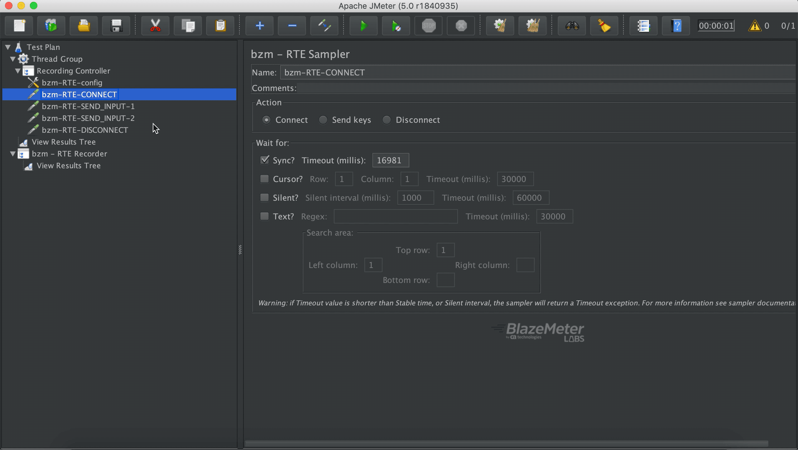

# RTE-Extractor

**REMEMBER**: This Extractor will ease the development of future implementations. Therefore is not mandatory for scripts creation. However could be use it in particular cases. 

The RTE Extractor is a component that must be embedded into a sampler.

How to add a RTE-Extractor:

The aim of the Extractor is to have the ability to look into response headers for a Field Position (from a given position) and to set a JMeter Variable with the corresponding field position.

Additionally you are able to skip fields using the tab offset.

<h5>Tab offset cases:</h5>
 - Case 1: Value equals to one, extractor will look for the closest field forward.
 - Case 2: Value bigger than one, extractor will look for the closets field forward and skip field as many times as indicated. E.g: with an offset of two, it will search for the next field and then, skip that one to finally get the next one. 
 - Case 3: Value equals to minus one, extractor will look for the closest field backwards.
 - Case 4: Value lower than minus one, same behaviour as **_case 2_** but backwards. E.g: offset equals to minus two, extractor will look for the nearest field backwards and then skip one.  

Also there is an option to set the cursor position as a JMeter variable.

In order to search for a field in the screen we have added Field Positions in Response Headers.

 
 
  Those positions are the real field positions. Place where we can insert values while recording. 

Going back to the extractor, there is an obligatory field, which will contain the prefix name of your future variable:

In the previous image we can visualize that the variable prefix **_position_** will have the cursor position of the current sampler. Therefore the variable will split in two parts: (row, column). The row value will be saved in a variable called **_position_ROW_** and the column value will be **_position_COLUMN_**
 > You can check how to use JMeter variables in your tests over [here](https://jmeter.apache.org/usermanual/functions.html#top).
 
 
 ### Example of usage
 
 Let's put the extractor to work. In order to do that, we are going to select the option _Extract next filed from position_ and we will give a position from where to search.
 
In this example we will look for the next field from position (1,2). As we have seen in the response headers picture, there is a field in position (1,27) which will be our target. In order to accomplish that, we must specify **tab offset** to 1.

Let's visualize all of this:

 > In this example we gave the extractor the beginning of a field (1,2), and as you could see, this one will search for the next field on the right, even when the given position is inside a field.
 