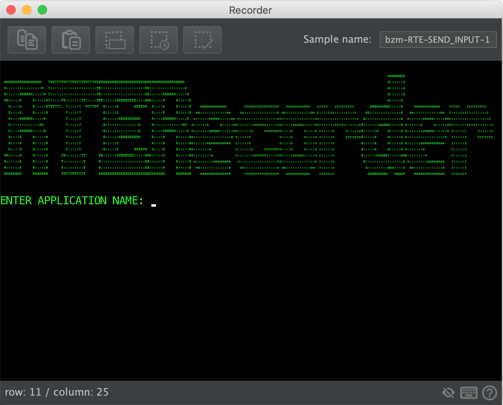
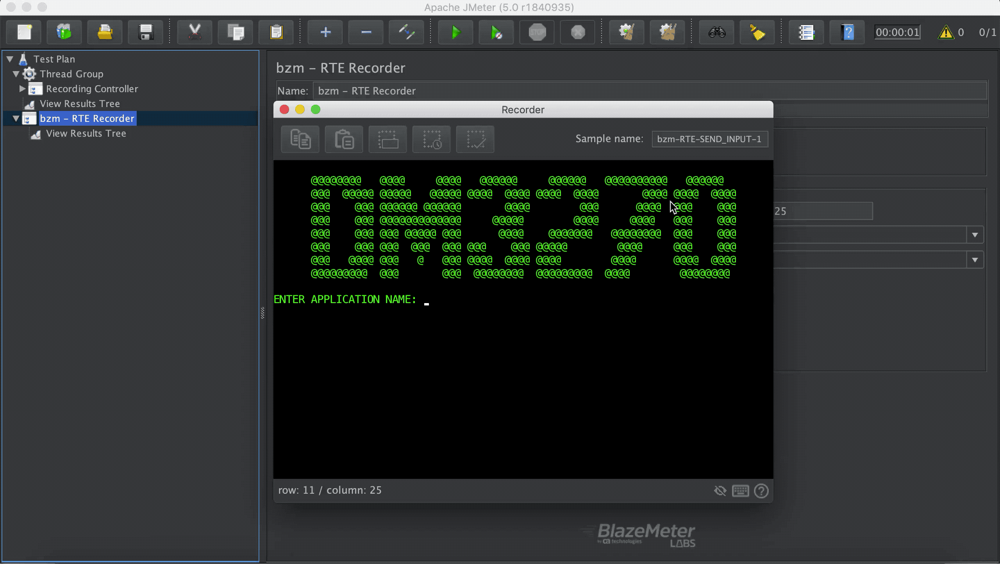

# Terminal Emulator

- Pressing  you are able to copy from the emulator, also using the standard keyboard shortcuts.
- Pressing  you are able to paste in cursor position on the emulator, also using standard shortcuts.
- You can select a screen area to be used as input field label, press  and then set the input field text, to record a test plan that uses the provided label to locate the input field on the screen and fill the field with provided text.
  > Input by label allows to find the field on the screen regardless of changes of field positioning, which makes recorded test plans more robust (than using default input by coord).
       
     >[Here](#input-by-label-usage) is a small example of input by label usage.  
- You can select a screen area to be used as wait for text and then press , a new *Text Wait Condition* has been added to your sampler.
     
    >[Here](wait-conditions-recording.md#text-wait-condition) is more information about wait for text, how it works and a little usage example.

- You can press assertion button  when you want to make sure that a part of the screen has appeared in the screen. This assertion has the same behaviour as JMeter Assertions. To assert for a part of the screen you just have to select a part of the screen and press the button. An assertion will be added to corresponding sampler.
    >[Here](#recorder-screen-assertion-usage) is an example of usage.

- If you click on the  icon in the emulator, a pop up window will be displayed with general help information on the emulator: shortcuts, explanation about indicators on the screen, etc.

    
### Input By Label Usage

### Recorder Screen Assertion Usage

