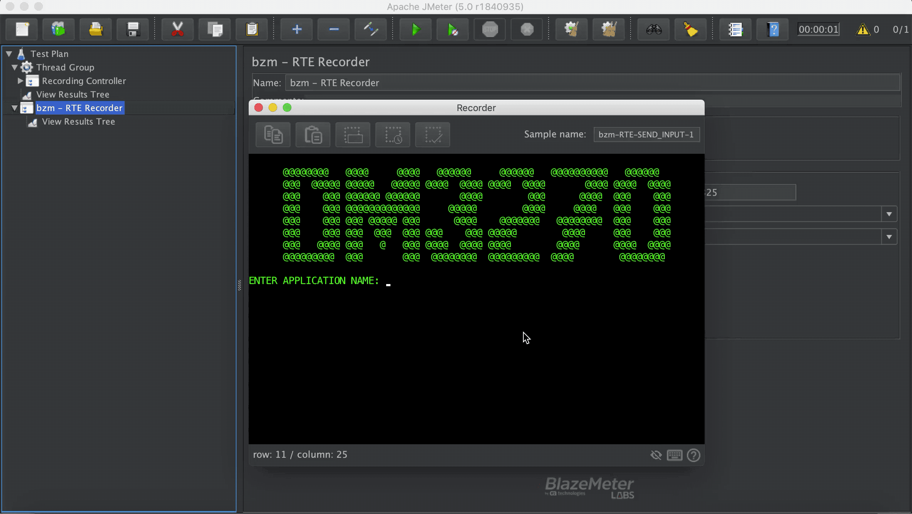

# Terminal Emulator

- Pressing   we are able to copy from the emulator, also using the standard shortcuts.
- Pressing    we are able to paste in cursor position on the emulator, also using  shortcuts.
- We should press   once we have already select a part of screen to be used as a label.
  > Label basically is a simple way to insert inputs instead of using the rudimentary *input by cords* but remember, must be selected in the left side of the willing to write field
  
  Once is pressed we proceed to insert our input.
     >[Here](#input-by-label-usage) there is a small example of input by label usage.  
- After we have selected a part of the screen to be used as wait for text, we press
     >[Here](wait-conditions-recording.md#text-wait-condition) there is more information about wait for text, how it works and a little usage example.

- We should press assertion button  when we want to make sure that a part of the screen has appeared in the screen. This assertion has the same behaviour as JMeter Assertions. To assert for a part of the screen we just have to select a part of the screen and press the button. An assertion will be added to corresponding sampler.
    >[Here]() there is an example of usage.

### Input By Label Usage

### Recorder Screen Assertion Usage

