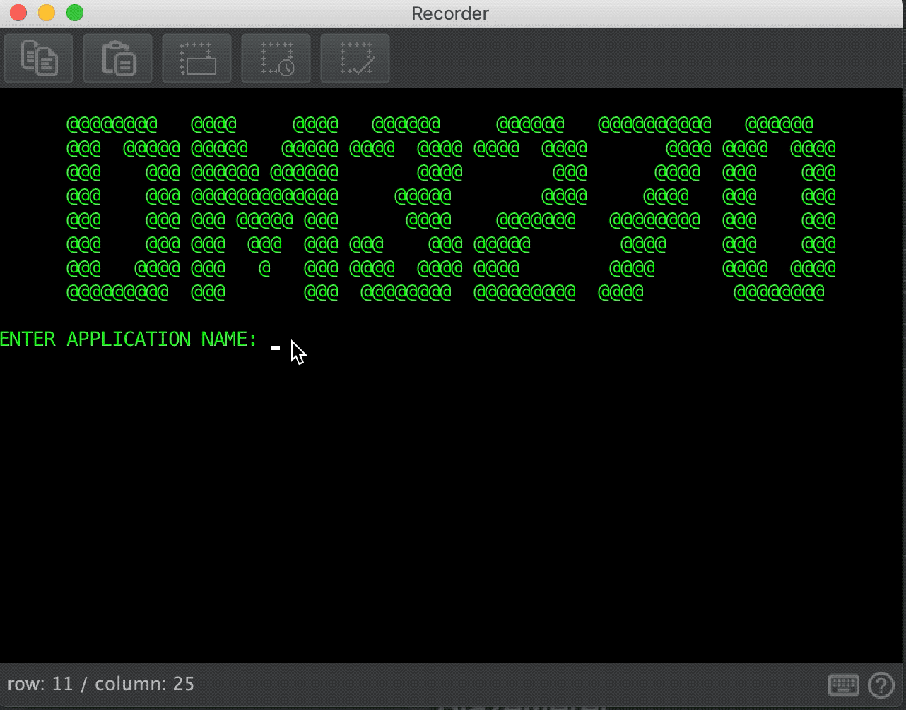
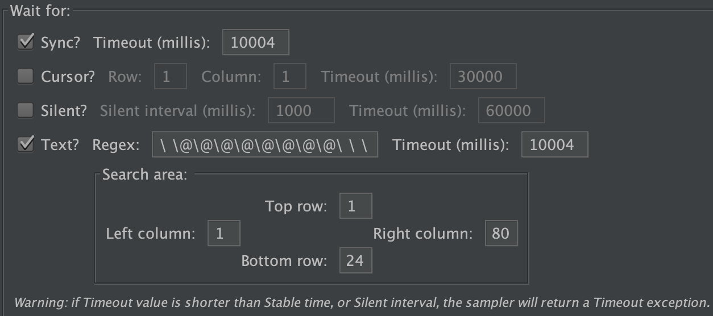
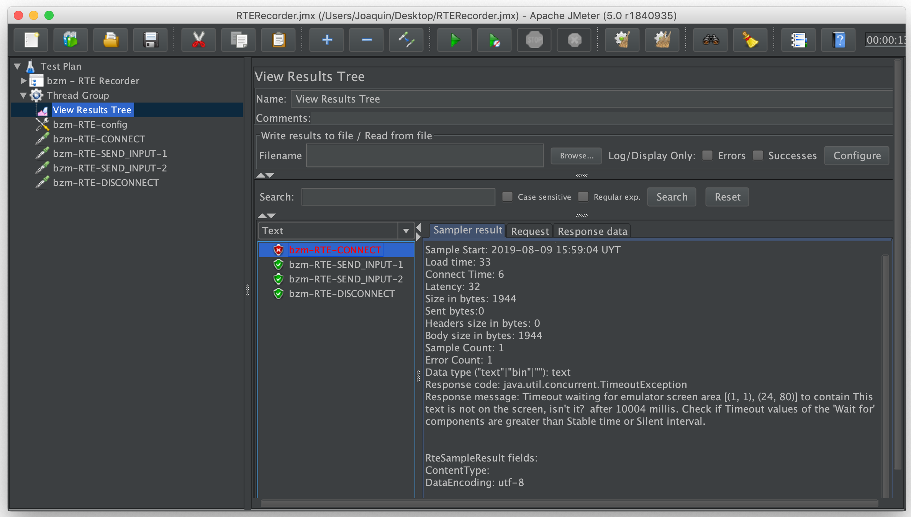

# RTE - Recorder Wait conditions.
To begin with the explication of how Wait Conditions works in RTE-Recorder, lets start by naming the supported wait conditions and a very descriptive definition.

*Silent wait*: It will wait for a period of time already defined.

*Sync wait*: It will wait till the keyboard is unlocked.

*Text wait*: It will wait until the text appears on the screen.

[Here](../README.md#waiters-usage) there is more information about Wait Conditions in general.

## Wait conditions recording resolution  
Wait conditions recording resolution is currently determined by the following 4 cases:
 
 **Case 1**: We have connected to the server but the terminal emulator has not received any keyboard status change so, the keyboard keeps locked. In this case the plugin will add a Silent Wait condition with the period of time between the connection and the next interaction. 
 
 **Case 2**: Consider now that we have received multiple keyboards status changes, so the keyboard has been unlocked and locked few/many times but the difference between those locks and unlocks is greater than **Stable Period**, then the plugin will add a Silent Wait Condition alongside a warning stating this behavior and a possible workaround in case the recorded behavior is not the expected one.
 
> [Here](../README.md#stable-period) for a description of stable period        
 
 **Case 3**: In this case our keyboard state has been changed once or several times but now the difference between those status changes is lower than stable period and also the difference between last keyboard unlock and last event occurred (like attention keys, inputs, etc) is lower than Stable Period. Then a Sync Wait Condition will be added to that sampler. If [Text Wait](#text-wait-condition) was called then a Text Wait Condition will be added to the sampler as well.
 
 **Case 4**: This case will include those possibles scenarios where none of the previously mentioned cases could take a part. As an example, keyboard status has been change several times, the difference between those status changes is lower than stable period, but the difference between last keyboard unlock, last event is bigger than Stable Period and Text Wait was not called. In this case a Sync Wait and a Silent Wait will be added to the sampler.
 
 
### Text Wait Condition

Text wait condition is feature that was released on version **2.1**, which allows the user to select a part of the screen to be used as a wait text condition. 
Essentially, this condition will wait until the part of the screen (already selected by user) appears on the screen again when the test plan runs.

Here there is a basic usage of text wait condition while using the emulator.

  
Once the recording finishes and corresponding samplers are created, we will notice that samplers, which are related with the already selected screen parts, have a wait condition text:

 

Now we are free to run our script. 
In case the selected part of the screen does not appear in time, or it does not appear at all, we will receive an unsuccessful result in View Result Tree indicating us the reason.

>In this example the regex has been changed by "*This text is not on the screen, isn't it?* "
 